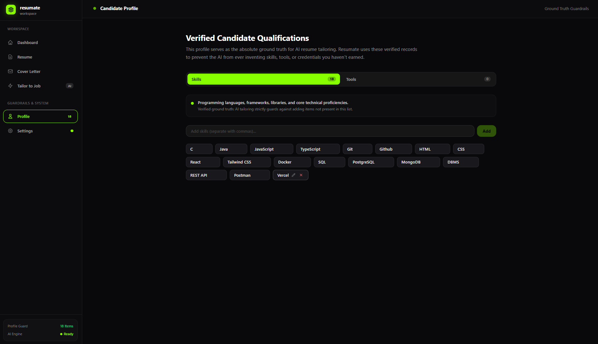
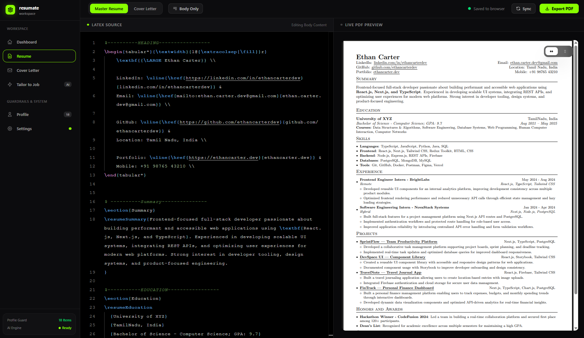
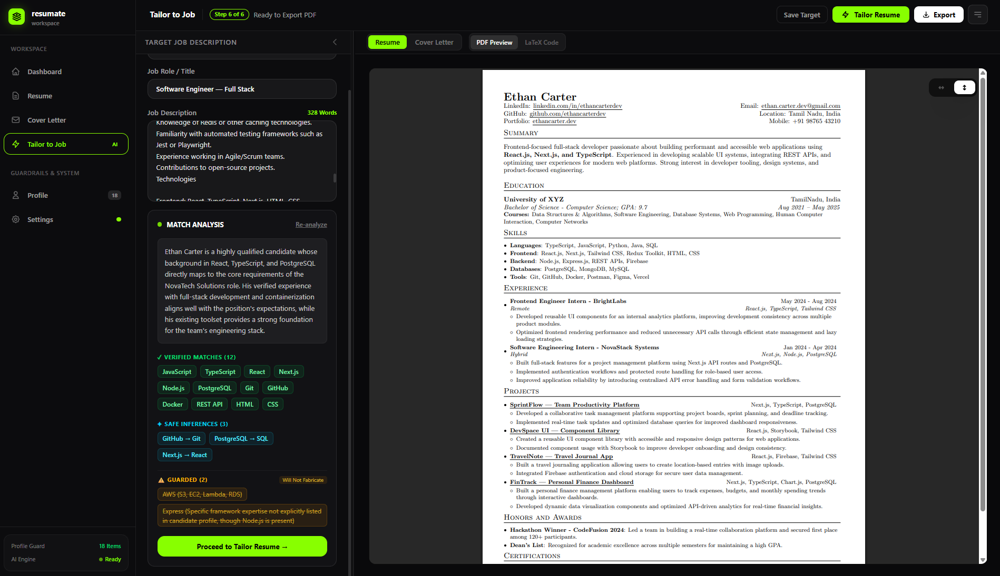
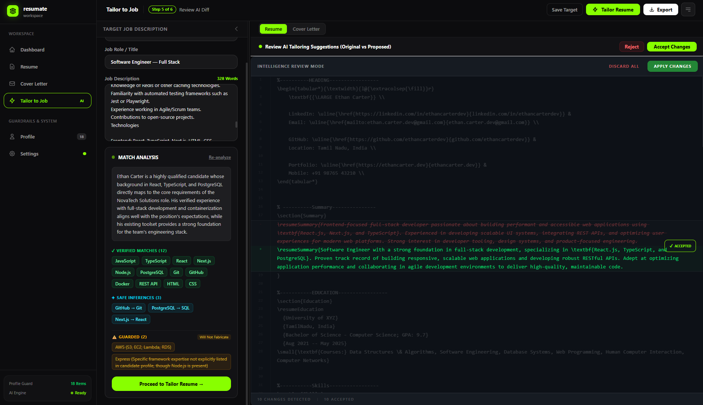

# Resumate ⚡

**Resumate** is a local-first, privacy-focused job application workspace designed to tailor LaTeX resumes and generate targeted cover letters using Google's Gemini API.

It enables you to maintain your master LaTeX resume templates and intelligently tailor the summary, technical skills, and experience/project descriptions to match any Job Description without breaking LaTeX syntax, inventing fake qualifications, or dropping existing sections.

---

## 🚀 Features

- **Ground Truth Guardrails**: Maintain your verified skills and tools in your Candidate Profile. The AI is strictly prevented from fabricating credentials or technologies you don't possess.
- **Job Alignment Analysis**: Instantly compare target job descriptions against your verified profile to discover verified matches, safe ecosystem inferences, and guarded unsupported skills.
- **Precision LaTeX Tailoring**: AI modifies only targeted sections (summary, skills, project/experience summaries) while preserving 100% of your LaTeX commands, formatting, and structural integrity.
- **Side-by-Side Diff Review**: Inspect proposed AI changes hunk-by-hunk in a Monaco diff editor. Accept or discard changes with a single click.
- **Real-Time PDF Compilation**: Integrated live PDF preview powered by your local LaTeX engine (`pdflatex`).
- **Local-First & Secure**: No backend database. All API keys and resume drafts are stored locally in your browser with automatic 30-day expiration policies and Dynamic Model Redundancy.

---

## 🛠️ Tech Stack

- **Framework**: [Next.js](https://nextjs.org/) (App Router & Server Actions)
- **Language**: [TypeScript](https://www.typescriptlang.org/)
- **UI & Styling**: [React](https://react.dev/), [Tailwind CSS](https://tailwindcss.com/)
- **Code Editor**: [Monaco Editor](https://microsoft.github.io/monaco-editor/)
- **AI Engine**: [Google Gen AI SDK](https://github.com/google-gemini/generative-ai-js) (Gemini 2.5 Flash / Pro)
- **Document Compiler**: [MiKTeX](https://miktex.org/) (`pdflatex`)

---

## 📦 Installation & Setup

### 1. Prerequisites (LaTeX Engine)

Resumate compiles LaTeX files directly into PDFs locally on your machine using `pdflatex`.

1. Download and install **MiKTeX**: [https://miktex.org/download](https://miktex.org/download)
2. During setup, ensure that MiKTeX is added to your system **`PATH`**.
3. Verify installation in your terminal:
   ```bash
   pdflatex --version
   ```

---

### 2. Clone & Install Dependencies

Clone the repository and install dependencies using your preferred package manager:

```bash
git clone https://github.com/anselumjuju/resumate.git
cd resumate
```

```bash
# Using pnpm (Recommended)
pnpm install

# Using npm
npm install

# Using yarn
yarn install
```

---

### 3. Run Development Server

```bash
# Using pnpm
pnpm dev

# Using npm
npm run dev

# Using yarn
yarn dev
```

Open your browser and navigate to [http://localhost:3000](http://localhost:3000).

---

## 🔄 User Workflow

```
Add Gemini Key ➔ Set Candidate Profile ➔ Edit Master LaTeX ➔ Tailor to Job ➔ Review Diff ➔ Export PDF
```

### Step 1: Add Google Gemini API Key

Resumate stores your Gemini API key strictly in your browser's local storage with an automated 30-day default expiration policy.

1. Get a free API key from [Google AI Studio](https://aistudio.google.com/).
2. Navigate to **Settings** (`/settings`) in Resumate.
3. Paste your key, select your preferred model (e.g. _Gemini 2.5 Flash_), and enable **Dynamic Redundancy** for automatic rate-limit failover.

---

### Step 2: Complete Your Candidate Profile

Define your verified ground truth skills and tools under **Profile** (`/profile`). Resumate uses this list as an absolute guardrail to ensure the AI never claims skills, libraries, or tools you haven't approved.

<p align="center">
  
</p>

---

### Step 3: Manage Master LaTeX Resume & Cover Letter

Edit your base LaTeX resume or choose from built-in standard templates in the **Resume** workspace (`/editor?tab=resume`). Changes compile automatically into live PDF previews with debounced rendering.

<p align="center">
  
</p>

---

### Step 4: Tailor to Job & Analyze Alignment

Navigate to **Tailor to Job** (`/workspace`):

1. Enter the **Company Name** and **Job Role / Title**.
2. Paste the target **Job Description** into the full-height input pane.
3. Click **Analyze Match** to run pre-optimization analysis. Resumate evaluates:
   - **Verified Matches**: Direct skill intersections.
   - **Safe Inferences**: Logical relationships (e.g., `GitHub` $\rightarrow$ `Git`, `Next.js` $\rightarrow$ `React`).
   - **Guarded Technologies**: Unsupported JD requirements the AI is forbidden from fabricating.
4. Click **Tailor Resume** to generate tailored resume sections and matching cover letter drafts.

<p align="center">
  
</p>

---

### Step 5: Review Changes & Export PDF

Review the side-by-side Monaco diff viewer showing additions and modifications. Accept or reject specific changes block-by-block, and click **Export PDF** to download your finalized PDF documents.

<p align="center">
  
</p>

---

## 🔒 Privacy & Security

- **No Remote Database**: All resume drafts, target job history, and profiles reside locally in your browser storage.
- **Client-Direct AI Calls**: Resumate communicates directly with Google Gemini using your personal API key via Next.js server actions.
- **Local Data Wipe**: You can safely clear all stored Resumate local data and API keys at any time from the Settings tab.

---

## 📄 License

MIT License. Feel free to use, modify, and distribute for personal or commercial projects.
